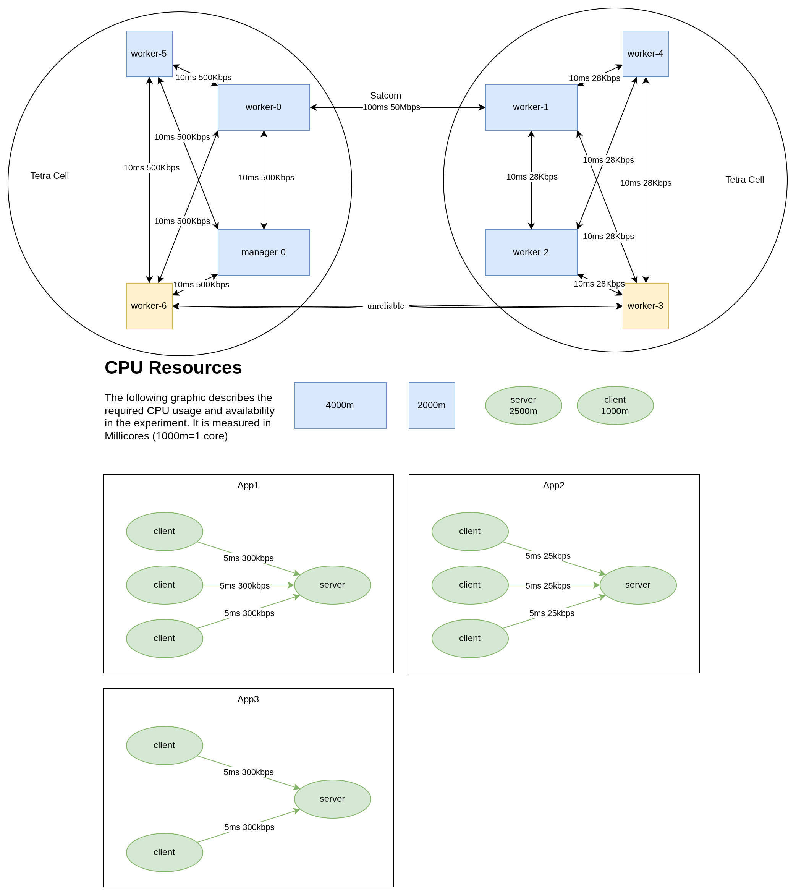

# Experiment 4

The fourth experiment is similar to the third but tries a more realistic scenario. We are running two TETRA cells, one with TEDS (500Kbits) and one without, resulting in 28Kbit. We are also running higher latencies on the links. This will incentivise the scheduler to colocate pods on the same host. To accomodate the lower throughput in the second TETRA cell, we also reduced the communication requirements

- The experiment runs for **10min**
- worker-6 and worker-3 are unreliable nodes. They reboot at minute {2,5,8}. The expected effect is, that the scheduler will avoid putting many pods on this node
- There are three Apps with 3 clients for a single server. All of them have 'high' communication requirements. They will exceed the links. We expect the scheduler to schedule clients in close proximity to their servers.
- **During the run, 3 pod-killing events will happen**
- No perfect schedule exists for this problem

## Walkthrough

### Preparation

Set up the experiment as depicted in the setup. Commit all applications to the cluster. Once all applications have been 'installed', start the scheduler and let it bind them to nodes. Once they are scheduled, proceed.

### Execution

Start the clock. Reboot worker-6 and worker-3 at minutes 2,5 and 8. At minute 10, shut down the cluster.

Additionally kill pods as follows:

- Min 3: Kill the server and one client of App1
- Min 6: Kill the server and one client of App2
- Min 9: Kill client and server of App4

### Collect Logs

Collect all the logs:

- [ ] Application Logs
- [ ] Scheduler Logs
- [ ] Scheduler network graph

## Setup

- 8 nodes, 11 pods
- Pods of pairings: 3->1, 3->1, 2->1
