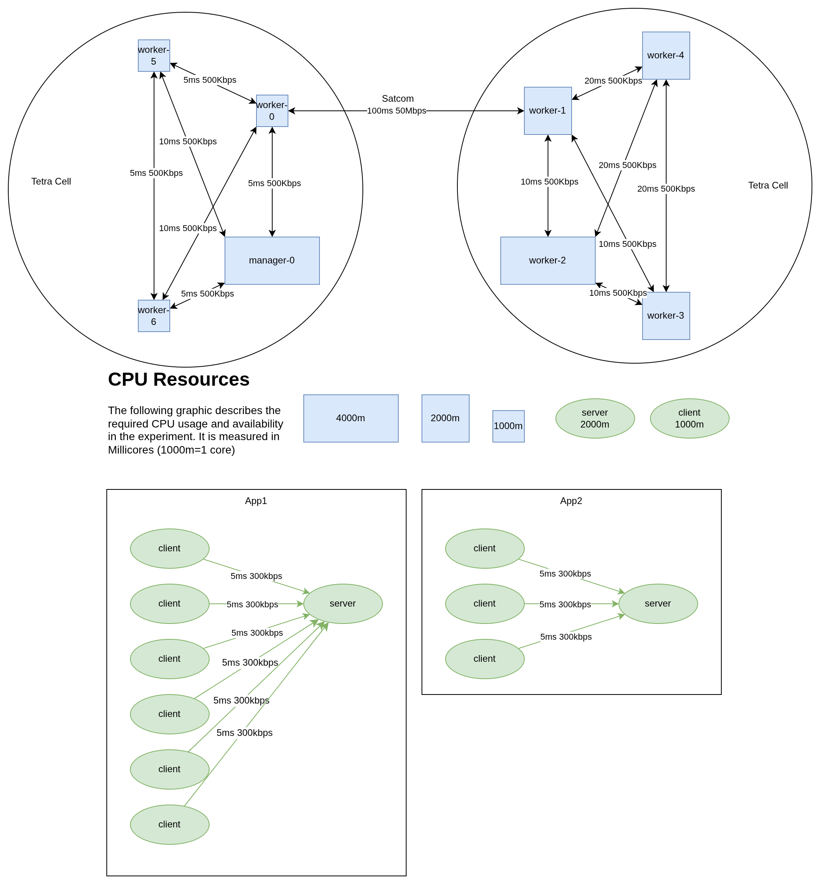

# Experiment 5

The fifth experiment is a simplification of the previous experiments. Less apps and less chaos. The outcome is fairly predictable. The most important changes are:

- No node failures
- Left cell has better latencies than right cell
- New smaller nodes with just 1CPU core

- The experiment runs for **10min**
- **During the run, 3 pod-killing events will happen**
- A perfect schedule exists for this problem

## Walkthrough

### Preparation

Set up the experiment as depicted in the setup. First, start the scheduler, then install app1. Wait for it to be scheduled, then continue with app2.

### Execution

Start the clock. At minute 10, shut down the cluster.

Additionally kill pods as follows:

- Min 3: Kill the server and one client of App1
- Min 6: Kill the server and one client of App2
- Min 9: Kill client and server of App1

### Collect Logs

Collect all the logs:

- [ ] Application Logs
- [ ] Scheduler Logs
- [ ] Scheduler network graph

## Setup

