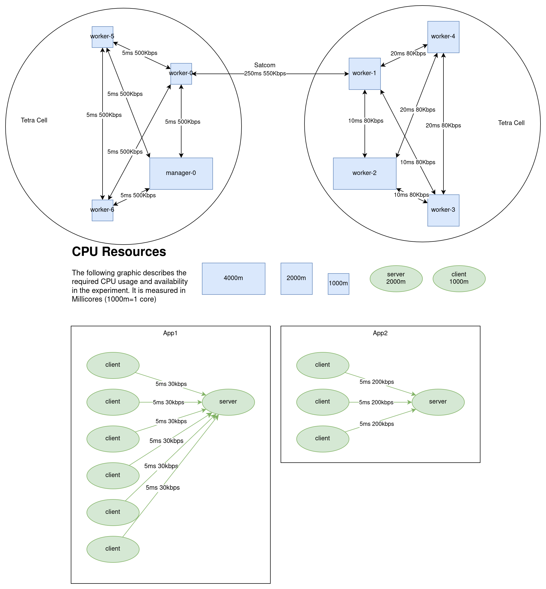

# Experiment 5

The seventh experiment uses the new satcom, and reduced comm reqs of App1. The clients have been updated to send smaller packets. The mahor changes are:

- App1 communicates less
- Satcom got reduced

## Walkthrough

### Preparation

Set up the experiment as depicted in the setup. Commit all applications to the cluster. Once all applications have been 'installed', start the scheduler and let it bind them to nodes. Once they are scheduled, proceed.

### Execution

Start the clock. At minute 10, shut down the cluster.

Additionally kill pods as follows:

- Min 3: Kill the server and one client of App1
- Min 6: Kill the server and one client of App2
- Min 9: Kill client and server of App1

### Collect Logs

Collect all the logs:

- [ ] Application Logs
- [ ] Scheduler Logs
- [ ] Scheduler network graph

## Setup

