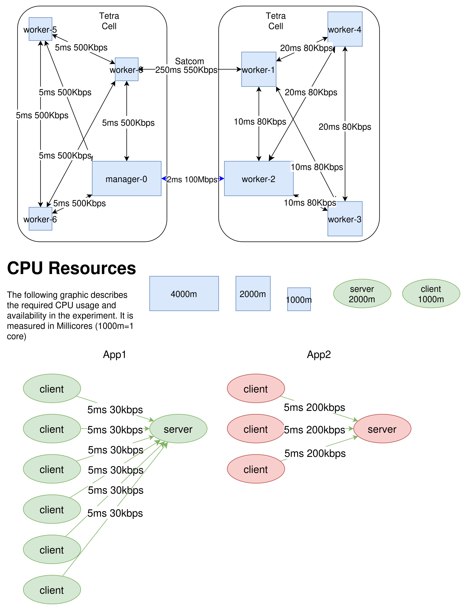

# Experiment 9

The ninth experiment includes a topology change. 

## Walkthrough

### Preparation

Set up the experiment as depicted in the setup. Commit all applications to the cluster. Once all applications have been 'installed', start the scheduler and let it bind them to nodes. Once they are scheduled, proceed.

### Execution

Start the clock. At minute 10, shut down the cluster.

Additionally kill pods as follows:

- Min 5: Take down the link between manager-0 and worker-2. Note that this is done by killing the connection and updating the data to the apiserver

### Collect Logs

Collect all the logs:

- [ ] Application Logs
- [ ] Scheduler Logs
- [ ] Scheduler network graph

## Setup

